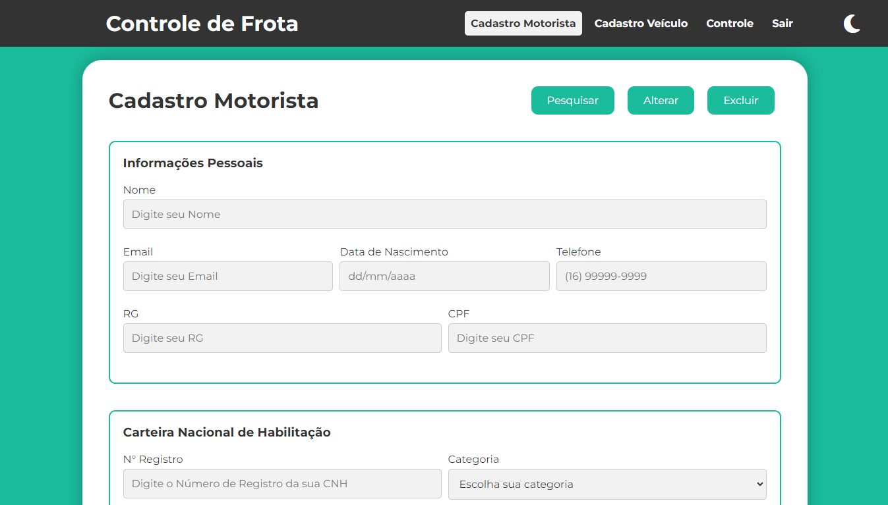
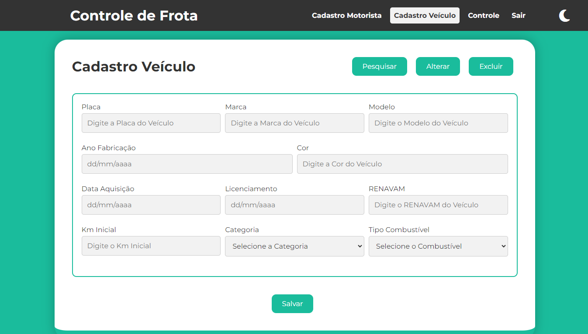

# Sistema de Controle de Frota

Este projeto de Sistema de Controle de Frotas foi desenvolvido visando proporcionar uma solução eficiente para gerenciar motoristas e veículos. O sistema inclui funcionalidades eficientes e uma interface intuitiva para facilitar a administração da frota.

<p align="center">
    <a href="https://controle-de-frota.vercel.app/" target="_blank">
    
    </a>
</p>

## Tecnologias Utilizadas 🛠️

Este projeto utiliza as seguintes tecnologias:

- **HTML:** Utilizado para estruturar as páginas web.
- **CSS:** Responsável pelo estilo e aparência visual do sistema.
- **Bootstrap:** Framework utilizado para facilitar o desenvolvimento responsivo e a estilização.
- **JavaScript:** Utilizado para a lógica e interatividade do sistema.

<br>

[](https://skillicons.dev)

## Funcionalidades Principais 🚀

* **Cadastro de Motorista**

    Permite cadastrar novos motoristas com informações detalhadas, como nome, CPF, CNH, entre outros dados relevantes.

* **Cadastro de Veículo**

    Facilita o cadastro de novos veículos, incluindo informações como modelo, placa, ano de fabricação, e outros atributos importantes para gestão da frota.

* **Relatórios de Entrada e Saída**

    Gera relatórios detalhados sobre a entrada e saída dos motoristas, indicando horários, datas, e veículos utilizados.

* **Controles**

    São geradas tabelas com as principais informações cadastradas em cada um dos itens acima, permitindo a edição e exclusão dos registros diretamente na interface do sistema.

<!-- <p align="center">
    
    
</p> -->

<p align="center">
    
</p>

## Características do Sistema 📝

* **Armazenamento Local:** Utiliza o `localStorage´ do navegador para armazenar os dados.
* **Tema Escuro:** Possui suporte para tema escuro, proporcionando uma experiência de agradável ao usuário.
* **Responsividade:** O sistema adapta-se automaticamente a diferentes dispositivos e tamanhos de tela.

<p align="center">
    
    
</p>

## Como Utilizar 🚀

Para executar o sistema localmente, clone este repositório e abra-o em seu navegador:

```bash
git clone https://github.com/joschonarth/sistema-gestao-frotas.git
```

## Acesse o Sistema 🖥️

Você também pode acessar e testar o sistema pelo seu navegador web:

🔗 [Sistema de Controle de Frotas](https://controle-de-frota.vercel.app/) 

## Contribuições 🌟

Contribuições são bem-vindas! Sinta-se à vontade para abrir uma issue com sugestões ou enviar um pull request com melhorias.

##

**Nota:** Este sistema é um protótipo, desenvolvido, a priori, para fins acadêmicos e pode ainda não estar adequado para uso profissional.

##

## Contato 📞

<div>
    <a href="https://www.linkedin.com/in/joschonarth/" target="_blank"></a>
    <a href="mailto:joschonarth@gmail.com" target="_blank"></a>
</div>
