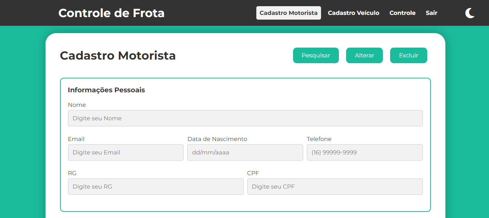

# Sistema de Controle de Frota

Este projeto de Sistema de Controle de Frotas foi desenvolvido visando proporcionar uma solução eficiente para gerenciar motoristas e veículos. O sistema inclui funcionalidades robustas e uma interface intuitiva para facilitar a administração da frota.


## Funcionalidades Principais

* **Cadastro de Motorista**

    Permite cadastrar novos motoristas com informações detalhadas, como nome, CPF, CNH, entre outros dados relevantes.

* **Cadastro de Veículo**

    Facilita o cadastro de novos veículos, incluindo informações como modelo, placa, ano de fabricação, e outros atributos importantes para gestão da frota.

* **Relatórios de Entrada e Saída**

    Gera relatórios detalhados sobre a entrada e saída dos motoristas, indicando horários, datas, e veículos utilizados.

* **Controles**

    São geradas tabelas com as principais informações cadastradas em cada um dos itens acima, permitindo a edição e exclusão dos registros diretamente na interface do sistema.

<div style="display: flex; flex-wrap: wrap;">
    
    
    
    
</div>


## Características do Sistema

* **Armazenamento Local:** Utiliza o `localStorage´ do navegador para armazenar os dados.
* **Tema Escuro:** Possui suporte para tema escuro, proporcionando uma experiência de agradável ao usuário.
* **Responsividade:** O sistema adapta-se automaticamente a diferentes dispositivos e tamanhos de tela.

<!-- <div style="display: flex; flex-direction: row; align-items: center; justify-content: center;">
    
    
</div> -->

<p align="center">
    
    
</p>

## Como Utilizar

Para executar o sistema localmente, clone este repositório e abra-o em seu navegador:

```bash
git clone https://github.com/joschonarth/sistema-gestao-frotas.git
```

## Contribuições

Contribuições são bem-vindas! Sinta-se à vontade para abrir uma issue com sugestões ou enviar um pull request com melhorias.

##

**Nota:** Este sistema é um protótipo desenvolvido, a priori, para fins acadêmicos e pode ainda não estar adequado para uso profissional.

##

## Contato:

<div>
    <a href="https://www.linkedin.com/in/joao-otavio-schonarth/" target="_blank"></a>
    <a href="mailto:joschonarth@gmail.com" target="_blank"></a>
</div>
